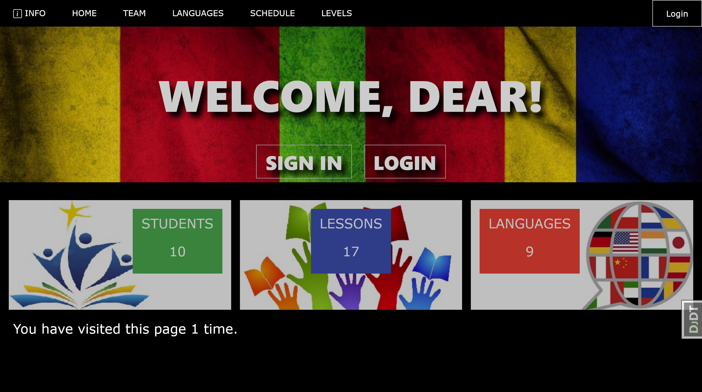
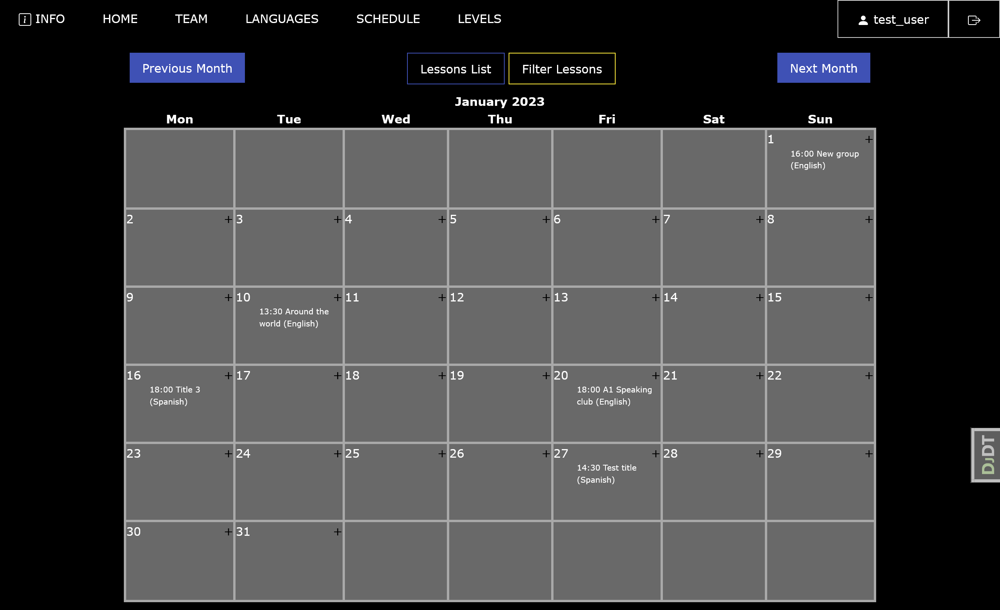

# Language Courses Lessons Manager
> 
> It is a website for language school. 
> It consists of two parts. 
> First part ("info") is a page like a business card with school general information 
> and with the ability to connect a contact form. 
> Second part ("study") is a part for students and teachers. 
> Every user can manage lessons and languages, 
> teacher can confirm lesson. 
> All lessons are shown on month calendar.


## Check it out!

This project deployed to [Render](https://language-courses.onrender.com/).<br>
Visitors can use the functionality of the site 
if they create a new user or use test user:
~~~ 
login: user
password: user12345
~~~


## Installing 

Pyton3 must be already installed

```shell
git clone https://github.com/UaMermaid/language-courses-lessons-manager
cd language-courses-lessons-manager
python3 -m venv venv
pip install -r requirements.txt
python manage.py runserver
```


## Features

* Authentication functionality for Student/User
* Managing lessons, languages from website
* View lessons as list and on month calendar
* Filter lessons by language and level
* Admin panel for advanced managing

## Demo

